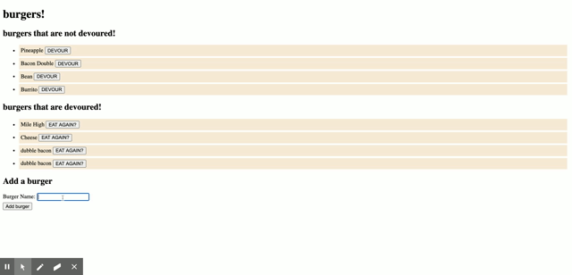

# NOTE TAKER
  For this project the objective was to make an app using backend server to save the data.
  Sequlize was put inplace to operate as the server.
  There are default burgers in place.
  You are able to add and remove burgers


# SCREEN SHOTS



# INSTALLATION
  Please clone this repo 
  Please do a npm install to install the required node modules


# NODE MODULES
  express


#### Directory structure

The following structure is in place

```
.
├── config
│   ├── connection.js
│   └── orm.js
│ 
├── controllers
│   └── burgers_controller.js
│
├── db
│   ├── schema.sql
│   └── seeds.sql
│
├── models
│   └── burger.js
│ 
├── node_modules
│ 
├── package.json
│
├── public
│   └── assets
│       ├── css
│       │   └── burger_style.css
│       └── img
│           └── burger.png
│   
│
├── server.js
│
└── views
    ├── index.handlebars
    └── layouts
        └── main.handlebars
```

